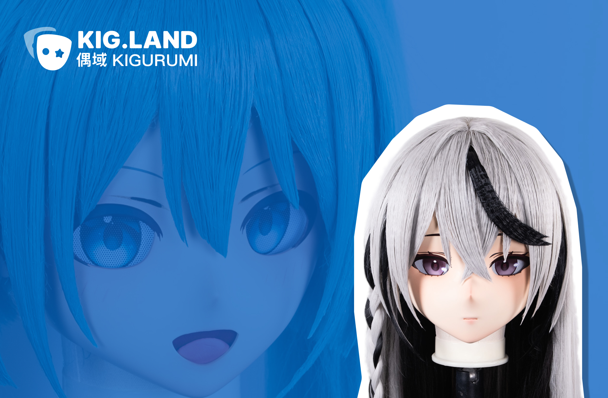

## KIGLAND - 偶域

> Bringing Characters to Life, Crafting Cosplayers' Delight

At KIGLAND, we specialize in creating high-quality, 2D-style Kigurumi cosplay masks, making character transformation more accessible and immersive than ever. By combining advanced 3D printing, CNC machining, and silicone molding, we industrialize what was once an artisanal craft, significantly reducing costs while maintaining superior quality.

Our open-source initiatives focus on developing custom modeling tools, production automation, and cosplay-related innovations, helping the community push the boundaries of character creation. Whether you're a cosplayer, maker, or developer, join us in revolutionizing the world of cosplay!

👉 Customize your product [www.kig.land](https://kig.land)

- [CurveLashMLP](https://github.com/u-u-z/CurveLashMLP) Deep Learning-Based (MLP) automatic eyelash curve generation for anime characters
- [Glasses Editor](https://glasses.github.com/) quickly customize KIGURUMI objects **with input size customization** and automatic splitting into FDM-friendly printable objects, support STL files export.
- [Craft](https://github.com/kigland/craft) your face! Sculpting tools that can directly customize and export STL files.
- [Blender toolbox](https://github.com/kigland/blender-toolbox) assists in engineering modeling and can also calculate costs.
- [Kigland CAM](https://x.com/Remi_IO/status/1807712942714212569/video/1) free G-Code generation tool, enabling artists to perform CNC work without needing CAD
- [3D Chinese Male Headform](https://github.com/kigland/gen-head) GB/T 23461-2009 3D dimensions of male adult headforms generator.
- [UV Layout tools](https://github.com/kigland/eyes-gen) Helps us to quickly follow the A4 layout when printing eye pieces.

Our mission is to bring joy to cosplayers with the most advanced technology—freeing them from concerns about appearance, body shape, age, gender, or ethnicity. [Join us](mailto:join@kig.land) !

