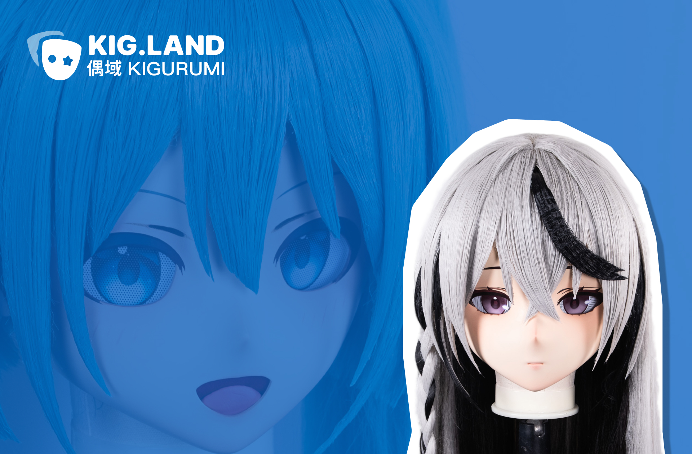

## KIGLAND - 偶域

<table>
  <tr>
    <td width="50%">
      
    </td>
    <td width="50%">
      
    </td>
  </tr>
</table>

KIGLAND builds infrastructure for personalized manufacturing.

We are developing a pipeline that maps **emotion and identity-driven intent** into **parameters, geometry, and manufacturable outputs**, enabling highly differentiated products to be produced at scale under real-world physical constraints.

Our system combines:

- proprietary datasets  
- domain-specific model training  
- AI-generated design workflows  
- production automation  
- agile hybrid manufacturing (3D printing + CNC + factory operations)

Our current focus is **2D-style Kigurumi cosplay masks**, where we translate highly subjective aesthetic preferences into repeatable, manufacturable results. The long-term goal is broader: building the technical stack for scalable personalization in physical products.

This organization contains our open-source work on modeling tools, manufacturing software, workflow automation, and experimental infrastructure for design-to-production systems.

👉 Customize your product [www.kig.land](https://kig.land)

- [KIGURUMI manual (zh-CN)](https://github.com/u-u-z/kigurumi)
- [CurveLashMLP](https://github.com/u-u-z/CurveLashMLP) Deep Learning-Based (MLP) automatic eyelash curve generation for anime characters
- [Glasses Editor](https://glasses.kig.land/) quickly customize KIGURUMI objects **with input size customization** and automatic splitting into FDM-friendly printable objects, support STL files export.
- [Craft](https://github.com/kigland/craft) your face! Sculpting tools that can directly customize and export STL files.
- [Blender toolbox](https://github.com/kigland/blender-toolbox) assists in engineering modeling and can also calculate costs.
- [Kigland CAM](https://x.com/Remi_IO/status/1807712942714212569/video/1) free G-Code generation tool, enabling artists to perform CNC work without needing CAD
- [3D Chinese Male Headform](https://github.com/kigland/gen-head) GB/T 23461-2009 3D dimensions of male adult headforms generator.
- [UV Layout tools](https://github.com/kigland/eyes-gen) Helps us to quickly follow the A4 layout when printing eye pieces.

Our mission is to bring joy to cosplayers with the most advanced technology—freeing them from concerns about appearance, body shape, age, gender, or ethnicity. [Join us](mailto:join@kig.land) !

